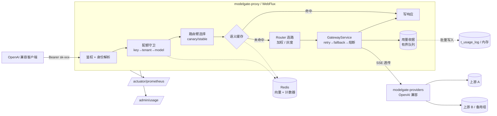
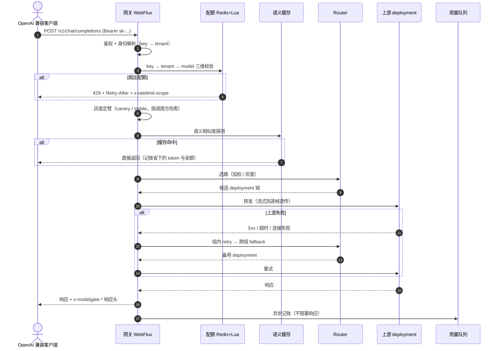

<div align="center">
  <h2>ModelGate</h2>

</div>

<div align="center">

面向大模型调用的 <strong>统一接入与流量治理网关</strong>。

把一个 OpenAI 兼容入口作为所有模型调用的唯一出口，由网关统一承担
多模型路由、灰度分流、多维配额、语义缓存、熔断降级与用量成本核算。

</div>

## 项目概览

客户端与上游模型之间多了一层网关，对外只暴露 OpenAI 兼容协议——因此任何支持自定义
`base_url` 的客户端或框架都能直接接进来，不需要改代码。



网关没有界面，它的「界面」是响应头与指标：**每个响应都自带这次调用的路由、缓存、成本信息**，
不需要翻日志就能解释一个请求到底发生了什么。

```bash
$ curl -s localhost:8080/v1/chat/completions -D - \
    -H "Authorization: Bearer sk-local-test-1" -H "Content-Type: application/json" \
    -d '{"model":"broken","messages":[{"role":"user","content":"hi"}]}'

HTTP/1.1 200 OK
x-modelgate-model-id: mock-fast-b
x-modelgate-attempted: mock-broken,mock-b     ← broken 组必返 500，已自动跨组降级
x-modelgate-cache: miss
x-modelgate-cost: 0.000009
x-modelgate-arm: single
{"id":"chatcmpl-mock-3145ed56","model":"mock-fast-b","choices":[...],"usage":{...}}
```

## 核心功能

模型调用的成本、延迟与上游稳定性都不由网关决定，但**能不能被观测、被约束、被降级**由网关决定。
四层能力都围绕这一点展开。

### 🚦 统一入口与多模型路由

> 业务只需要认模型别名，上游怎么扩容、怎么换厂商都与调用方无关。

- **OpenAI 兼容协议** — `/v1/chat/completions`（流式 / 非流式）与 `/v1/models`；Provider SPI 让新增上游只是多一个实现。
- **别名 → deployment 两层结构** — `fast-medium` 是业务别名，下面可以挂多个真实部署（不同厂商 / 不同实例），按权重选路。
- **三层语义分离** — retry（组内换部署）/ fallback（跨组）/ cooldown（摘掉单个部署）是**三件不同的事**，不是一坨重试。
- **流式透传与背压** — SSE 逐帧 flush，不缓冲整个响应；流式 failover 只发生在**首个 chunk 之前**。

### 🛡️ 分层流量治理

> 上游会抖、调用方会超量，网关要在它们影响到业务之前拦住。

- **三层配额** — key / tenant / model 三个维度，RPM 走滑动窗口、TPM 按真实用量记账；Redis 场景下三维由**一个 Lua 脚本原子校验**。
- **熔断** — `CLOSED → OPEN → HALF_OPEN` 状态机，双信号触发（连续失败 **或** 窗口失败率），冷却时间指数退避。
- **降级可追溯** — 每个响应回 `x-modelgate-attempted`，完整失败链一眼可见，不用去猜"这次到底走了哪条路"。
- **拒绝也是协议** — 429 带 `Retry-After` 与 `x-ratelimit-scope`，调用方能自己退避，而不是盲目重试。

### 💰 成本与命中率

> 大模型调用是少见的"降低成本靠改代码"的成本项：同样的答案没有理由付两次钱。

- **语义缓存** — 请求 Embedding 做余弦检索，命中直接返回；按调用方隔离 namespace；in-flight 合并防冷缓存击穿。
- **用量收据** — 每次请求落一条（token / 缓存命中 / 路由臂 / 尝试链 / TTFT / 成本）；热路径只入有界队列，异步批量写库。
- **成本按真实计价** — prompt cache 的命中与写入倍率不同（OpenAI 0.5× / 2×，Anthropic 双边 1.25×），在网关层解析 `prompt_tokens_details` 后计价。
- **灰度可归因** — 按调用方哈希分桶，同一调用方永远落同一臂；用量表按 `ARM` 维度聚合，实验数据能直接比对基线。

### 🔭 可观测与可验证

> 网关类项目最容易糊弄过去的地方：数字从哪来、量的是哪条路径。

- **15 类指标** — 包含 `overhead_latency`（端到端 − 上游 = 网关自身开销）、`ttft`（首 token 延迟）、`in_flight`、`circuit_state`。
- **Grafana 面板随环境自动加载** — 由 provisioning 注入，不需要手工导入 JSON。
- **Mock 上游** — 可控延迟、逐帧 pacing、注错、确定性 embedding；压测数字能说清口径，也解释了为什么它们不与厂商公开基准比较。
- **JVM 对照实验** — G1 vs ZGC 在 P99 长尾上的差异，堆外内存单独观测（Reactor Netty 的 ByteBuf 不在堆上）。

## 系统流程

一次非流式请求的完整链路，包含缓存命中与上游失败两条分支：



## 技术栈

| 层次 | 技术 | 用途 |
| :--- | :--- | :--- |
| 运行时 | Java 21、Spring Boot 3.5.6、Maven 多模块 | 网关主体与模块化边界 |
| Web | Spring WebFlux（Reactor Netty）、SSE | OpenAI 兼容入口、流式逐帧透传与背压 |
| 治理 | 自研 `router` / `quota` / `cache` / `usage` | 加权路由、灰度分桶、熔断、三层配额、语义缓存 |
| 存储 | Redis 7（Lua 脚本）、H2 / MySQL 8 | 共享配额与缓存、用量落库（同一套 SQL） |
| 观测 | Micrometer、Prometheus、Grafana | 15 类指标与看板 |
| 压测 | JMeter、自建 Mock 上游 | QPS / P99 / 错误率与 JVM 对照 |
| 部署 | Docker、Docker Compose | 一键起整套环境（`observability` / `loadtest` 两个可选 profile） |

## 本地运行

### 环境要求

| 组件 | 要求 | 说明 |
| :--- | :--- | :--- |
| JDK | 21 | 宿主机直跑时需要 |
| Maven | 3.9+ | 构建。**必须带 `-s maven-settings.xml`**，原因见常见问题 |
| Docker | Compose v2 | 可选。用它就不需要本机装 JDK / Redis |
| Redis | 7 | 可选。只有 `backend: redis` 或容器 `docker` profile 才需要 |
| JMeter | 5.6.3 | 可选。压测时需要 |

### 方式一：Docker Compose（推荐）

本机不需要装 JDK、Redis，全部组件在容器里：

```bash
docker compose up -d --build                     # redis + mock-a + mock-b + 网关
docker compose --profile observability up -d     # 再加 Prometheus(9090) + Grafana(3000)
```

网关监听 `8080`。容器运行与宿主机直跑**共用同一份路由配置**（上游地址是环境变量占位符），
完整说明、已知边界与实测记录见 [docker/README.md](docker/README.md)。

### 方式二：宿主机直跑

默认走内存后端，不依赖 Redis：

```bash
mvn -s maven-settings.xml clean install

java -jar modelgate-mock/target/modelgate-mock-*.jar --server.port=9001 --mock.name=A
java -jar modelgate-mock/target/modelgate-mock-*.jar --server.port=9002 --mock.name=B
java -jar modelgate-proxy/target/modelgate-proxy-*.jar
```

### 快速验证

下面几个请求分别验证入口、失败降级、语义缓存与流式透传：

```bash
U=http://127.0.0.1:8080/v1/chat/completions
H='Authorization: Bearer sk-local-test-1'
CT='Content-Type: application/json'

# 1. 基本调用：看响应头就知道路由到哪个上游、花了多少钱
curl -s $U -H "$H" -H "$CT" -D - \
  -d '{"model":"fast-medium","messages":[{"role":"user","content":"hi"}]}'

# 2. 失败降级：broken 组必返 500，观察 x-modelgate-attempted 的完整失败链
curl -s $U -H "$H" -H "$CT" -D - \
  -d '{"model":"broken","messages":[{"role":"user","content":"hi"}]}'

# 3. 语义缓存：这条命令连跑两次，第二次拿到 x-modelgate-cache: hit + 相似度
curl -s $U -H "$H" -H "$CT" -D - \
  -d '{"model":"fast-medium","messages":[{"role":"user","content":"cache me"}]}'

# 流式（SSE 逐帧透传）
curl -sN $U -H "$H" -H "$CT" -H 'Accept: text/event-stream' \
  -d '{"model":"fast-medium","stream":true,"messages":[{"role":"user","content":"hi"}]}'
```

可用别名：`fast-medium`（两实例 7:3 加权）、`smart`、`broken`（恒 500，用于演练降级）、`ab-test`（灰度）。
演示密钥：`sk-local-test-1`（限模型、60 rpm）、`sk-local-test-2`（`*`、600 rpm）。

### 常见问题

| 现象 | 处理方式 |
| :--- | :--- |
| IDE 整片报红、`Missing artifact io.modelgate:...` | 新模块必须先 `mvn -s maven-settings.xml clean install`（`package` 不够），再让 IDE 重新导入 Maven 工程。详见[实现细节](docs/implementation.md)第 11 节 |
| Maven 报 `maven-default-http-blocker`，或依赖被装进项目目录 | 必须带 `-s maven-settings.xml`：全局 settings 的 `localRepository` 指向 Windows 路径、镜像是 http |
| `401 Missing or invalid API key` | 检查 `Authorization: Bearer sk-local-test-1`；`loadtest` profile 下演示密钥会失效，该 profile 只认 `sk-load-test` |
| `403 key 'xxx' is not allowed to use model 'yyy'` | 该 key 的 `models` 白名单不含这个模型（`sk-local-test-2` 是 `*`） |
| `429 Too Many Requests` | 配额生效，看 `x-ratelimit-scope` 与 `Retry-After`；`sk-local-test-1` 只有 60 rpm |
| 压测全是 401、QPS 虚高到几千 | 没激活 `loadtest` profile——`sk-load-test` 这个密钥只定义在 `application-loadtest.yml` 里 |
| 压测 QPS 异常高，或权重看起来全落一个上游 | 固定 prompt 命中了语义缓存，量到的是缓存路径。见[实现细节](docs/implementation.md)第 9 节 |
| 容器内压测报 `NoRouteToHostException` | 压测器在 bridge 网络的连接上限；`jmeter` 服务已配 host 网络，用 `--no-deps` 跑 |

## 目录结构

```text
ModelGate
├── modelgate-core/        # canonical OpenAI 格式类型（零依赖，全系统唯一数据契约）
├── modelgate-providers/   # Provider SPI + OpenAI 兼容泛化实现
├── modelgate-router/      # 加权路由 / 灰度分桶 / retry / fallback / 熔断状态机
├── modelgate-quota/       # 三层配额（进程内 + Redis+Lua 双后端）
├── modelgate-cache/       # 语义缓存（余弦检索 + in-flight 合并）
├── modelgate-usage/       # 用量与成本（有界队列 + 异步批量落库 + 多维聚合）
├── modelgate-client/      # 传输层：WebClient + SSE 解析 + 超时归一 + 计价
├── modelgate-proxy/       # 对外网关（Spring Boot WebFlux）
├── modelgate-mock/        # Mock 上游（压测与故障演练）
├── modelgate-testkit/     # 测试基建
├── docker/                # 容器化配置与运行手册
├── loadtest/              # JMeter 计划、汇总脚本与压测报告
├── ops/                   # Prometheus 抓取配置、Grafana 面板、生产 DDL
├── verify/                # 分周功能验证记录
├── docs/                  # 实现细节与面试话术
├── Dockerfile             # 多阶段构建：proxy / mock 两个运行时 target
└── docker-compose.yml     # redis + mock×2 + 网关（含 observability / loadtest profile）
```

## 已知边界

这些是**有意留下**的边界，不打算用"看起来完整"来掩盖：

- **上游是 Mock**：Provider SPI 与 OpenAI 兼容实现是真的，但演示链路不接真实厂商。
  所有 QPS / P99 都注明上游为 Mock 及机器规格，不与厂商公开基准做比较。
- **熔断状态是进程内的**：多副本各看各的。`RouterState` 接口已抽好，Redis 实现照
  `modelgate-quota` 的模式补即可。
- **MySQL 控制面未接线**：身份与路由目前仍由 `application.yml` 承担，
  `t_tenant` / `t_api_key` / `t_model` 的 DDL 已就位；用量落库已接通（本地 H2，生产同一套 SQL）。
- **不做管理后台 UI**：观测走 Grafana，控制面走 `/admin/**` API。网关的交付面是
  OpenAI 兼容接口 + Prometheus 指标，不是页面。
- **不做 100+ Provider**：3~4 家 + OpenAI 兼容协议泛化接入，覆盖绝大多数上游。

## 文档索引

| 想了解 | 看 |
| :--- | :--- |
| 机制怎么实现、有哪些开关、实测结论 | [docs/implementation.md](docs/implementation.md) |
| 实施计划与排期 | [plan.md](plan.md) |
| 容器化与它的坑 | [docker/README.md](docker/README.md) |
| 指标清单与 Grafana 面板 | [ops/README.md](ops/README.md) |
| 压测报告 | [W2](loadtest/RESULTS.md) · [W3（JVM 对照）](loadtest/RESULTS-W3.md) |
| 分周功能验证记录 | [W3](verify/W3-verification.md) · [W4](verify/W4-verification.md) |
| 面试话术与交底 | [docs/interview-narrative.md](docs/interview-narrative.md) |

## 参考实现

ModelGate 的设计不是凭空来的。它会做这个形态，是因为先读了三个开源项目：

| 项目 | 技术栈 | 贡献了什么 |
| :--- | :--- | :--- |
| [BerriAI/litellm](https://github.com/BerriAI/litellm) | Python + Rust | **事实标准与术语来源**：model group vs deployment、retry / fallback / cooldown 三者的区分、virtual key、级联预算、dual cache、in-flight 请求合并、`overhead_latency`、TTFT |
| [yonglun/java-litellm](https://github.com/yonglun/java-litellm) | Java 21 + Spring Boot 3 | **Java 栈的分层与工程骨架**（LiteLLM 开源部分的 Java 重写）：`core → providers → client → router → proxy` 单向依赖、canonical 类型作为全系统唯一数据契约、Provider SPI 扩展、同一接口下的 in-process / Redis 双实现 |
| [zouyee/llmlite](https://github.com/zouyee/llmlite) | Zig | 熔断的 `CLOSED / OPEN / HALF_OPEN` 状态机、P50/P95/P99 延迟跟踪，以及 `/metrics` **按上游维度打标**的思路 |

这些参考点具体落在哪：

| 参考点 | 在 ModelGate 里的形态 |
| :--- | :--- |
| 五层单向依赖 | `modelgate-core` / `-providers` / `-client` / `-router` / `-proxy`；另拆出 `quota` / `cache` / `usage` 三块，它们只依赖 `core` |
| core 作为唯一数据契约 | 所有上游的请求与响应都归一到 `modelgate-core` 的 OpenAI 格式类型，避免"每个 Provider 一套 DTO 到处转换" |
| Provider SPI | 新增一家上游 = 多一个实现，不动核心代码 |
| 一个接口两套后端 | 配额、缓存、路由状态都是「进程内 / Redis」两套实现共用一个接口——同时解决"本地零依赖能跑"与"多副本能共用状态" |
| 概念区分落到代码 | retry（组内换部署）/ fallback（跨组）/ cooldown（摘单个部署）是三条独立路径，不是一坨重试 |
| 指标按维度打标 | `modelgate_*` 指标带 `model_group` / `provider` / `stream` / `deployment` 等标签，上游劣化时能直接定位到是哪一个 |

### 没有照搬的部分

- **不做管理门户 UI**：LiteLLM 有一个功能完整的 `/ui/`（虚拟密钥、团队、消费看板）。这里把观测交给 Grafana、控制面交给 `/admin/**` API——网关的交付面是接口与指标，不是页面。
- **不做运行时动态配置**：LiteLLM 的 `config.yaml` 支持热重载，这里用 Spring profile + 环境变量，配置变更即重建实例——换取"任何一份运行配置都能在 Git 里被 review"。
- **并发模型换了一条路**：不做 Python 的 asyncio 单事件循环，流式透传走 Reactor / WebFlux，靠背压而不是"把 worker 数堆高"来控制内存。

> `java-litellm` 仓库最近从旧名 `Vincent-Ye/java-litellm` 改过名，旧地址会 301 重定向；
> 上面写的是当前地址。

## License

本项目基于 [MIT License](LICENSE) 开源。
