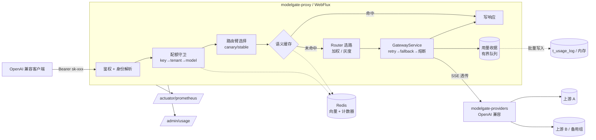

# ModelGate

面向大模型调用的统一接入与流量治理网关：多模型路由 / 灰度分流 / 多维配额 / 语义缓存 /
熔断降级 / 用量与成本核算。

- 实施计划：[plan.md](plan.md)
- 压测报告：[W2](loadtest/RESULTS.md) · [W3（JVM 对照）](loadtest/RESULTS-W3.md)
- 功能验证：[W3](verify/W3-verification.md) · [W4](verify/W4-verification.md)
- 面试话术：[docs/interview-narrative.md](docs/interview-narrative.md)

## 模块

```
modelgate-core        canonical OpenAI 格式类型（零依赖，全系统唯一数据契约）
modelgate-providers   Provider SPI + OpenAI 兼容泛化实现（chat + embeddings）
modelgate-router      加权路由 / 灰度分桶 / retry(组内) / fallback(跨组) / 熔断状态机
modelgate-quota       三层配额（key / tenant / model）：进程内 与 Redis+Lua 双后端
modelgate-cache       语义缓存：余弦检索 + 进程内/Redis 双后端 + 嵌入缓存 + in-flight 合并
modelgate-usage       用量与成本：有界队列 + 异步批量落库 + 多维聚合
modelgate-client      WebClient 传输 + SSE 解析 + 超时归一 + 成本/缓存计价
modelgate-mock        Mock 上游（延迟 / 逐帧 pacing / 注错 / 确定性 embedding / 模拟 prompt cache）
modelgate-proxy       Spring Boot WebFlux 网关（对外交付形态）
modelgate-testkit     测试基建（一次性 redis-server 等）
```

## 架构与请求链路



一次非流式请求的顺序：**鉴权 → 配额三层校验 → 定臂 → 语义缓存探测 → 路由（retry/fallback/熔断）
→ 写响应 → 异步记账**。流式请求跳过缓存（要等答案全部生成才知道重复，那时 token 已经花了），
逐帧 flush 透传。

依赖方向是单向的：`core ← providers ← client ← proxy`，`router`/`quota`/`cache`/`usage` 只依赖 `core`，
所以路由、配额、缓存、计量四块逻辑都能脱离 HTTP 单独单测。

## 构建与运行

```bash
# 用项目自带 settings：全局 settings.xml 的 localRepository 指向 Windows 路径、
# 且镜像是 http 会被 Maven 3.9 拦截（详见 maven-settings.xml 内注释）
# 用 install 而非 package：模块间依赖要先落到本地仓库，IDE 才能解析
mvn -s maven-settings.xml clean install

java -jar modelgate-mock/target/modelgate-mock-*.jar --server.port=9001 --mock.name=A
java -jar modelgate-mock/target/modelgate-mock-*.jar --server.port=9002 --mock.name=B
java -jar modelgate-proxy/target/modelgate-proxy-*.jar

# 非流式
curl -s localhost:8080/v1/chat/completions \
  -H "Authorization: Bearer sk-local-test-1" -H "Content-Type: application/json" \
  -d '{"model":"fast-medium","messages":[{"role":"user","content":"hi"}]}'

# 流式（SSE 逐帧透传）
curl -sN localhost:8080/v1/chat/completions \
  -H "Authorization: Bearer sk-local-test-1" -H "Content-Type: application/json" \
  -H "Accept: text/event-stream" \
  -d '{"model":"fast-medium","stream":true,"messages":[{"role":"user","content":"hi"}]}'

# 故障演练：broken 组强制 500，验证跨组 fallback
curl -s localhost:8080/v1/chat/completions \
  -H "Authorization: Bearer sk-local-test-1" -H "Content-Type: application/json" \
  -d '{"model":"broken","messages":[{"role":"user","content":"hi"}]}' -D -
# 响应头 x-modelgate-attempted: mock-broken,mock-b 显示完整失败链
```

整个环境（网关 + 两个 Mock + Redis）也可以一键起容器，本机不需要装 JDK / Redis：

```bash
docker compose up -d --build                     # redis + mock-a + mock-b + proxy
docker compose --profile observability up -d     # 再加 Prometheus + Grafana（面板自动加载）
```

宿主直跑与容器运行**共用同一份路由配置**（上游地址走占位符 `${MODELGATE_MOCK_A_URL:...}`），
差别只是环境变量。已知边界、压测口径与实测记录见 [docker/README.md](docker/README.md)。

## IDE 报红怎么办（先看这里）

现象：`Missing artifact io.modelgate:modelgate-xxx:jar:0.1.0-SNAPSHOT`、`Maven Dependencies
references non existing library ...`，随后整片 `cannot be resolved`。

原因：**IDE 是按本地仓库解析模块间依赖的**。当新增了一个模块（比如 W2 的 `modelgate-quota`、
W3 的 `modelgate-cache` / `modelgate-testkit`），在它被 `install` 到本地仓库、且 IDE 重新导入
Maven 工程之前，IDE 会一直抱着"这个 jar 不存在"的旧结论并级联报红。

处置（两步）：

```bash
# 1. 让依赖真正落到本地仓库（package 不够，必须是 install）
mvn -s maven-settings.xml clean install

# 2. 让 IDE 重新解析
#    IntelliJ IDEA：Maven 面板 → 🔄 Reload All Maven Projects（必要时再 Build → Rebuild Project）
#    Eclipse / m2e：项目右键 → Maven → Update Project（Alt+F5），勾选 Force Update
```

判断"到底是代码问题还是 IDE 缓存问题"，用这条命令即可：
**不带 `-am`、纯离线**地单独构建某个模块，它能过就说明本地仓库解析链路是通的。

```bash
mvn -s maven-settings.xml -o -pl modelgate-proxy clean package -DskipTests
```

## 路由与熔断

| 机制 | 范围 | 触发 |
|---|---|---|
| retry | model group 内换 deployment | 5xx / 429 / 连接失败 / 超时（4xx 不重试，也不计入熔断） |
| fallback | 跨 group（按 `modelgate.router.fallbacks` 顺序） | 当前组全部失败 |
| 熔断 | 单个 deployment | 连续失败 ≥ `allowed-fails` **或** 窗口内失败率 ≥ `failure-rate-threshold` |

熔断状态机：`CLOSED → OPEN →(冷却到期) HALF_OPEN →(探测成功) CLOSED / (探测失败) OPEN`。
冷却时间随连续熔断**指数退避**（1× → 2× → 3×，上限 10×）。
两个触发信号缺一不可：连续失败抓硬故障，失败率抓"轮流失败"的抖动上游。

流式请求的 failover 只发生在**首个 chunk 之前**——已有字节到达客户端就不再重试，否则会重复输出。

## 灰度分流（canary / A-B）

按**调用方（API key）哈希分桶**决定臂，同一调用方永远落在同一臂——否则灰度期间用户会在两个变体之间
来回跳，数据既无法归因也会被用户察觉。响应头回 `x-modelgate-arm`，用量表里也记臂。

```yaml
modelgate:
  router:
    groups:
      ab-test:
        canary-deployment: mock-ab-canary   # 实验臂由哪个 deployment 承载
        canary-percentage: 30               # 30% 的调用方
        deployments:
          - { name: mock-ab-stable, model-id: mock-fast-a, base-url: http://127.0.0.1:9001, weight: 10 }
          - { name: mock-ab-canary, model-id: mock-fast-b, base-url: http://127.0.0.1:9002, weight: 10 }
```

stable 臂不会给 canary 部署分流量；canary 部署被熔断时，连实验臂的调用方也会回落到稳定池。

⚠️ **分桶必须做哈希雪崩**：`String.hashCode()` 对顺序发放的 id（`key-a`、`key-b`…）是连续值，
直接取模会让整批调用方一起进同一臂（实测 `key-a`..`key-s` 在 30% 阈值下占 73%）。
实现里先过一遍 MurmurHash3 的 32 位 finalizer，仍保持跨 JVM / 跨副本确定。

## 语义缓存

```
请求 → 嵌入向量（按 prompt 哈希缓存，命中则零开销）
     → 在 namespace 内做余弦检索
         命中 → 直接返回，记账省下的 token 与金额
         未命中 → 走上游 → 异步回填缓存
```

- **namespace = `sc:{keyId}:{modelGroup}:{paramsHash}`**：key 是隔离边界的一部分，
  一个调用方的答案不会泄露给另一个调用方；把 key 去掉就是安全事故。
- **阈值默认 0.95**：只吃"同一问题 + 标点/空白差异"；0.85 能命中改述，但有答非所问风险
  （用 `modelgate_cache_similarity` 的分布来决定该往哪边调）。
- **in-flight 合并**：冷缓存瞬间的 N 个相同请求只打一次上游，其余共享结果——
  压测里 30s 内合并掉 149 万次请求。
- **缓存永不阻断请求**：嵌入/检索任何异常都降级为正常上游调用，并累加 `cache_degraded_total`。
- **流式不查缓存**：流式答案要等全部生成完才知道是不是重复，那时 token 已经花掉了。

```yaml
modelgate:
  cache:
    enabled: true
    backend: memory        # memory = 单实例；redis = 多副本共享
    similarity-threshold: 0.95
    embedding-deployment: mock-embed   # 承接 embedding 的 deployment 名
    coalescing-enabled: true
```

## 三层配额

维度与检查顺序：**key → tenant → model**（最具体者先拦）。RPM 走滑动窗口，TPM 按真实 usage
在调用完成后异步记账。Redis 场景下三个维度由**一个 Lua 脚本原子校验**（1 次 RTT 而非 3 次）。
超限返回 `429` + `Retry-After` + `x-ratelimit-scope`。

```yaml
modelgate:
  quota:
    backend: memory     # memory = 单实例；redis = 多实例共享计数
```

## 用量与成本

每次请求落一条收据（requestId / key / tenant / 模型 / token / 缓存命中 / 路由臂 / 尝试链 /
TTFT / 成本）。热路径只做一次 `offer` 入有界队列，后台线程批量写库：
**一个慢的数据库永远不能让一次推理变慢**，代价是账单最终一致、队列打满会丢记录——
所以 `dropped`（服务了但没收到钱）是最该告警的指标。

```yaml
modelgate:
  usage:
    backend: memory        # memory | jdbc
    queue-capacity: 20000  # 打满即丢，绝不阻塞请求
    batch-size: 500
    flush-interval-millis: 1000
```

成本不能简单按 tokens × 单价：**prompt cache 的命中与写入倍率不同**（OpenAI 命中 0.5×、写入 2×；
Anthropic 两边 1.25×），所以 `usage.prompt_tokens_details` 在网关层解析并计价——
实测同一段 ~1000 token 的 prompt，命中 90% 的臂成本 `0.000097`，另一臂 `0.000164`。

```bash
# 按维度聚合：DATE / TENANT / MODEL / KEY / ARM（ARM = 灰度归因）
curl -s "localhost:8080/admin/usage?dimension=ARM&from=2026-09-16&to=2026-09-16" \
  -H "Authorization: Bearer sk-local-test-1"
curl -s localhost:8080/admin/usage/stats -H "Authorization: Bearer sk-local-test-1"

# jdbc 后端（本地用 H2，同一套 SQL；生产换 MySQL 的 URL/驱动即可）
java -jar modelgate-proxy-*.jar --modelgate.usage.backend=jdbc \
  --spring.sql.init.mode=always \
  --spring.sql.init.schema-locations=classpath:db/schema-h2.sql
```

生产 DDL（含 `t_tenant` / `t_api_key` / `t_model` 控制面）见 [ops/sql/schema.sql](ops/sql/schema.sql)。

## 可观测性

指标清单、Prometheus 抓取配置与 Grafana 面板见 [ops/README.md](ops/README.md)。
最关键的两个：`modelgate_overhead_latency`（端到端 − 上游，即网关自身开销）与
`modelgate_circuit_state`（0 CLOSED / 1 OPEN / 2 HALF_OPEN）。

```bash
curl -s localhost:8080/actuator/prometheus | grep ^modelgate_ | sort
```

## 压测

```bash
# 负载 profile（配额关闭，见 profile 内注释）
java -jar modelgate-proxy/target/modelgate-proxy-*.jar --spring.profiles.active=loadtest

jmeter -n -t loadtest/modelgate-chat.jmx \
  -Jhost=127.0.0.1 -Jport=8080 -JapiKey=sk-load-test \
  -Jthreads=100 -Jramp=5 -Jduration=30 -Jjtl=/tmp/gateway.jtl
loadtest/stats.sh /tmp/gateway.jtl      # 输出 QPS / P50 / P95 / P99 / 错误率
```

容器里的等效跑法（`docker,loadtest` 双 profile 与 `--no-deps` 都是必须的，
理由见 [docker/README.md](docker/README.md) 4.1）：

```bash
SPRING_PROFILES_ACTIVE=docker,loadtest docker compose up -d proxy
MODELGATE_CACHE_ENABLED=false docker compose --profile loadtest run --rm --no-deps jmeter
```

⚠️ 上面这个 JMeter 计划**每次迭代发的是同一个 prompt**。想量"上游转发路径"就必须
`MODELGATE_CACHE_ENABLED=false`，否则第 2 次起全部命中语义缓存，量到的是缓存路径
（实测 219 QPS vs 6175 QPS，同样都是 0% 错误）。同理，验证**权重分布**时也要每个请求换
prompt，否则数到的是缓存里那条响应的模型名——会把 7:3 显示成 100:0。

实测结论（详见 [loadtest/RESULTS-W3.md](loadtest/RESULTS-W3.md)）：

| 轮次 | 配置 | QPS | P99 | 最长 GC 暂停 |
|---|---|---|---|---|
| R1 | 默认 JVM | 13,126 | 21ms | 30.7ms |
| R2 | G1 + 固定堆 2g / 堆外 1g | 13,865 | 18ms | 27.3ms |
| R3 | ZGC + 固定堆 2g / 堆外 1g | 14,764 | 14ms | **0.1ms** |
| R4 | G1 + 语义缓存开启 | **53,790** | **9ms** | 19.1ms |

- **换 GC 换不来吞吐**（13.1k~14.8k 属同机噪声，ZGC 两次跑出 11.6k / 14.8k），
  但**暂停时间差 108 倍**（ZGC 总暂停 2.6ms vs G1 281.8ms），直接反映在 P99 上。
- 目前收益最大的单项是语义缓存：吞吐 3.9×，P50 从 6ms 降到 1ms。

## 响应头

| 头 | 含义 |
|---|---|
| `x-modelgate-model-id` | 实际命中的上游模型 |
| `x-modelgate-attempted` | 完整尝试链 |
| `x-modelgate-cost` | 本次调用成本（USD，按价目表计算） |
| `x-modelgate-cache` / `x-modelgate-cache-similarity` | `hit` / `miss` 与相似度 |
| `x-modelgate-arm` | 本次请求的路由臂：`canary` / `stable` / `single` |
| `x-ratelimit-remaining-requests` | 当前窗口剩余请求数 |
| `Retry-After` / `x-ratelimit-scope` | 仅 429 时出现 |
